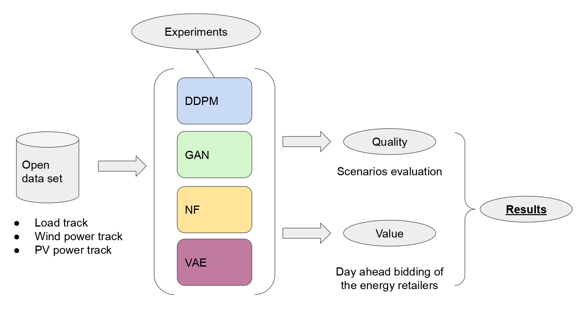

# DDPM-Power-systems-forecasting

This repository contains some of the code base related to the master thesis: Denoising diffusion probabilistic models applied to energy forecasting in power systems.

DDPMs are a class of deep generative models. In this work they are applied to the task of senarios generation for power system application.

## High level overview of the frawework

