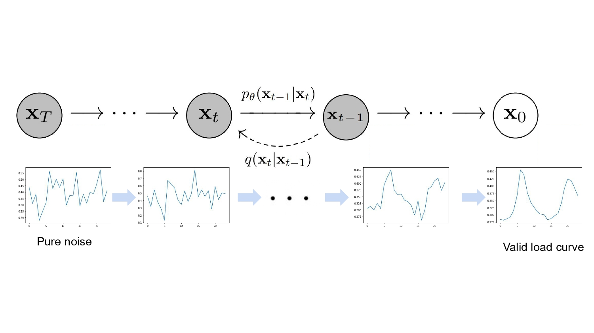
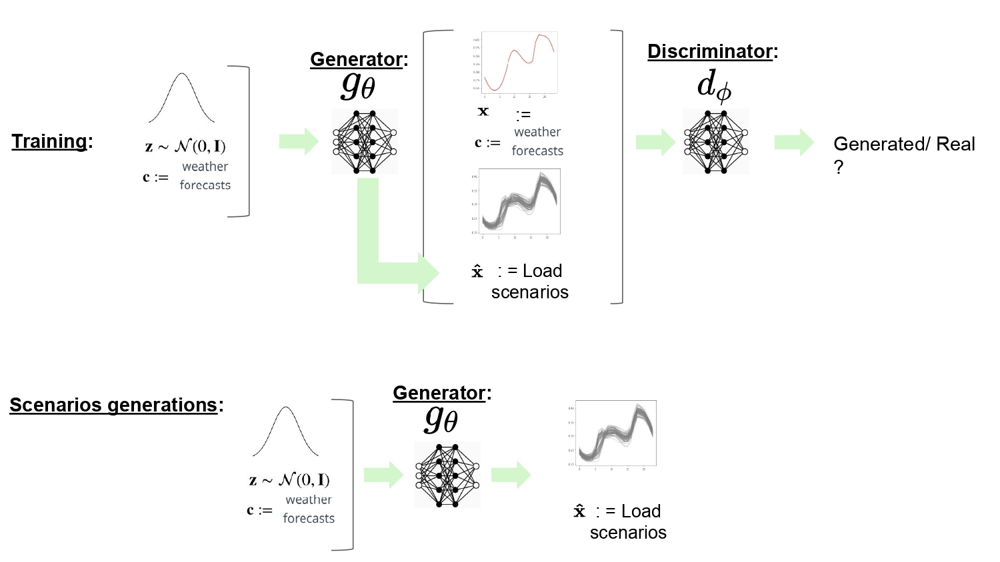
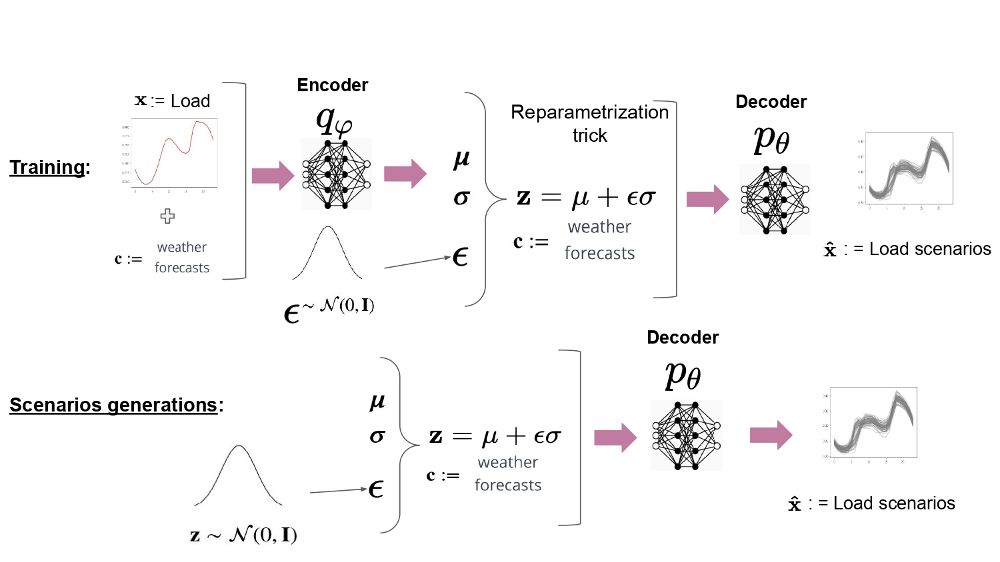
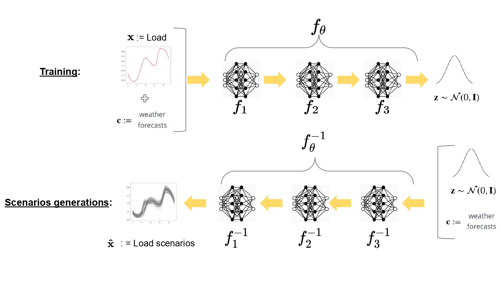
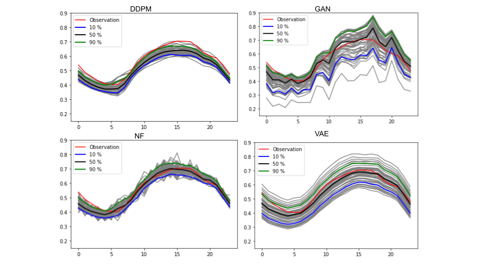

# DDPM-Power-systems-forecasting

This repository contains some of the code base related to the master thesis: Denoising diffusion probabilistic models applied to energy forecasting in power systems.

DDPMs are a class of deep generative models. In this work they are applied to the task of senarios generation for power system application. They have been trained and tested thanks to the GEFcom2014 open datasets. They also have been extensively compared to GAN, VAE and NF. The code for the GAN, VAE and NF have been reused from :https://github.com/jonathandumas/generative-models

## High level overview of the frawework

This repo contains jupyter notbooks relative to the training, some of the experiments, and some of the metrics used for the quality assessment. The value assessment is not there yet.

## DDPM process

## GAN Process

## VAE Process

## NF Process

## Comparison of the 4 models with load scenarios generation

